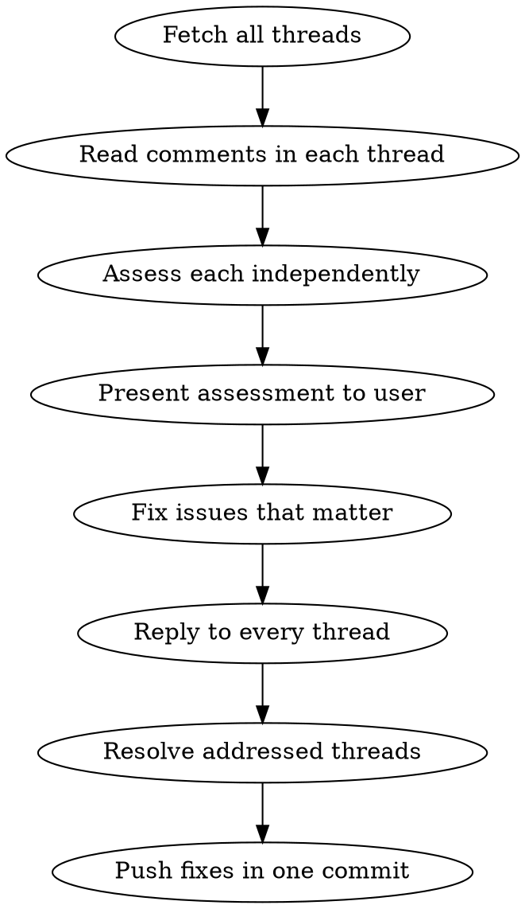

# Address PR Review (GitHub)

## Overview

Assess PR review comments skeptically, fix only what genuinely matters, and close the loop on
every thread. The default failure mode is agreeable compliance: fixing things you correctly
assessed as unnecessary just because a reviewer raised them.

> PR review threads are read and updated via the **GitHub CLI** (`gh`). Inline review threads can
> only be **resolved** through the GraphQL API (REST has no resolve endpoint), so the thread's
> GraphQL node id (`PRRT_…`) is the single handle used to both reply and resolve.

## When to Use

- User says "look at comments", "address review", "check PR feedback"
- After a PR has been created and review threads exist
- When code review comments need responses

## Prerequisites

- `gh` CLI, authenticated (`gh auth status`).
- **Owner/repo is auto-detected** from the git remote — `gh` resolves it; never hardcode it.
- PR number — detect from the current branch (see "Finding the PR Number") or take it as an argument.

## Core Process



### 1. Fetch and Read All Threads First

Read every thread before acting. Do not start fixing after the first comment.

```bash
PR=24   # the PR number (see "Finding the PR Number")

# Inline review threads: GraphQL gives the node id (needed to reply + resolve),
# resolved flag, and every comment in the chain. Owner/repo auto-resolved by gh.
gh api graphql -f query='
  query($owner:String!,$repo:String!,$pr:Int!){
    repository(owner:$owner,name:$repo){
      pullRequest(number:$pr){
        reviewThreads(first:100){
          nodes{
            id isResolved isOutdated
            comments(first:50){ nodes{ path line author{login} body } }
          }
        }
      }
    }
  }' \
  -F owner="$(gh repo view --json owner -q .owner.login)" \
  -F repo="$(gh repo view --json name -q .name)" \
  -F pr="$PR"

# Top-level review summaries + general PR comments (not attached to a diff line):
gh pr view "$PR" --comments
```

Focus on unresolved threads with real feedback. Skip resolved/outdated threads and bot/CI chatter
unless the user asks otherwise.

### 2. Assess Each Comment Independently

For each thread, classify:

| Classification | Action | Criteria |
|---------------|--------|----------|
| **Fix** | Code change needed | Correctness bug, security issue, real-world breakage |
| **Clarify** | Add reply/docs only | Valid confusion, non-obvious code, missing context |
| **Decline** | Reply explaining why | Theoretical concern, style preference, hypothetical future risk |

### 3. Present Assessment Before Acting

Show the user your classification of each item with reasoning. Let them override before you start
fixing.

```
| # | Thread | File | Classification | Reasoning |
|---|--------|------|---------------|-----------|
| 1 | "This null check..." | lib/foo.ts:42 | Fix | Genuine null-ref risk |
| 2 | "Consider using..." | lib/bar.ts:18 | Decline | Style preference, current approach is correct |
```

### 4. Fix, Reply, Resolve, Push

**Fix** only classified issues. Commit per the repo conventions (see `CLAUDE.md` — e.g. the
`Co-Authored-By` trailer); branch first if you're on the default branch.

**Reply** to every thread (whether fixing or declining), addressing it by its `PRRT_…` node id:

```bash
THREAD=PRRT_xxxxx   # node id from step 1

gh api graphql -f query='
  mutation($threadId:ID!,$body:String!){
    addPullRequestReviewThreadReply(input:{pullRequestReviewThreadId:$threadId, body:$body}){
      comment{ id }
    }
  }' -F threadId="$THREAD" \
     -f body="Fixed — added a null check for the case where X is undefined."
```

**Resolve** the threads you addressed (REST cannot do this — GraphQL only):

```bash
gh api graphql -f query='
  mutation($threadId:ID!){
    resolveReviewThread(input:{threadId:$threadId}){ thread{ isResolved } }
  }' -F threadId="$THREAD"
```

> Convention: resolve threads you **fixed**. For **declines**, reply with the reasoning and leave
> the thread unresolved so the reviewer can resolve it (or resolve it if your team's norm is
> author-resolves). GitHub has no per-thread status taxonomy — a thread is simply resolved or not.

**Push** once with all fixes.

> Tip: for reply bodies with backticks/quotes, pass `-f body="@reply.txt"` (read from a file) to
> avoid shell quoting pain.

## Red Flags: Stop and Reconsider

- Reversing a correct technical assessment because a reviewer raised a concern
- Fixing something you just said was unnecessary
- Saying "good point" when you don't actually think it's a good point
- Making a change to avoid appearing dismissive
- Replying "fixed" before actually making the change

## GitHub CLI / API Reference

`gh` auto-detects owner/repo from the remote, so most commands need no coordinates.

| Action | Command |
|--------|---------|
| Find PR for current branch | `gh pr view --json number -q .number` |
| List threads (id + comments) | `gh api graphql` → `pullRequest.reviewThreads` (see step 1) |
| Top-level + general comments | `gh pr view <pr> --comments` |
| Reply to a thread | `gh api graphql` → `addPullRequestReviewThreadReply` |
| Resolve a thread | `gh api graphql` → `resolveReviewThread` |
| Unresolve a thread | `gh api graphql` → `unresolveReviewThread` |
| Create inline comment thread | `gh api repos/{owner}/{repo}/pulls/{pr}/comments` (`commit_id`+`path`+`line`+`side`) |
| Post a plain PR comment | `gh pr comment <pr> --body "…"` |
| PR details | `gh pr view <pr> --json title,state,headRefName,…` |

### Finding the PR Number

```bash
# PR linked to the current branch (owner/repo auto-detected). Empty output = no PR yet.
gh pr view --json number -q .number 2>/dev/null \
  || gh pr list --head "$(git branch --show-current)" --state open --json number -q '.[0].number'
```
